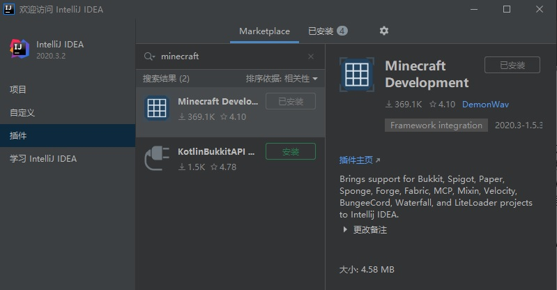

# 环境配置

## Java安装配置
如果你不是云玩家，你应该已经在安装minecraft时安装了Java8（如果没有，请自行搜索相关教程）

打开Java的安装目录（Windows下，一般是C:\Program Files\Java），如果有jdk1.8.0开头的文件夹，那一般就没问题了，如果只有一个jre1.8.0开头的文件夹，那么说明安装的是JRE(Java Runtime Environment)（用于运行Java应用），需要安装JDK(Java Development Kit)（用于开发Java应用）
一般常用的JDK有两种：Oracle JDK和AdoptOpenJdk，安装任意一个即可
### 安装Oracle JDK
1、打开[JDK官网](https://www.oracle.com/cn/java/technologies/javase/javase-jdk8-downloads.html)
2、找到适合自己系统的版本
3、点击下载，根据指示注册登录
4、下载安装

**注意：Oracle JDK的使用协议比较迷，最好不要用于商业用途，如果用于商业用途被Oracle寄律师函，本站不负责任**

### 安装AdoptOpenJDK
1、打开[JDK官网](https://adoptopenjdk.net/releases.html?variant=openjdk8&jvmVariant=hotspot)
2、找到适合自己系统的版本
3、下载**JDK（注意分辨，JDK都是至少80MB的，如果只有30MB左右说明下载错了）**，选择.msi（Windows）、.pkg（Mac OS）、.tar.gz（Linux）后缀的文件下载
4、安装

**AdoptOpenJDK中国大陆下载可能不稳定，可以使用特殊方法，AdoptOpenJDK使用Apache2.0协议开源，商业使用基本没有风险**

## Intellij IDEA软件安装
1、打开[IDEA官网](https://www.jetbrains.com/zh-cn/idea/)
2、根据官网指示下载，Community和Ultimate版本都可以（**Ultimate版本为付费软件，根据相关法律法规，本站不提供破解补丁及方法。开发插件Community够用。之后教程中使用Ultimate演示，两个版本操作基本完全一样。**）
3、根据指示打开后，点击左侧菜单中"*Plugins*"，搜索"中文语言包"，安装并重启软件
4、点击左侧菜单中"*插件*"，搜索"*Minecraft*"，安装图中第一个(*Minecraft Development*):
