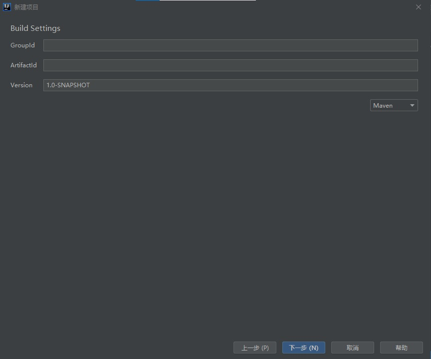

# 创建项目

在打开IDEA后的主界面，以此点击*项目*——*新建项目*——（左侧选择）*Minecraft*——*Spigot Plugin*（目前版本Bukkit不能开发1.16插件），进入下图中界面：

最终的默认包名为{`GroupID`}.{`ArtifactID`},为避免冲突，如用于生产环境，{`ArtifactID`}.{`GroupID`}应为您拥有的域名或邮箱名，测试环境可以随意。演示中，`GroupID`为`io.github`，`ArtifactID`为`sheepbukkittutorial`